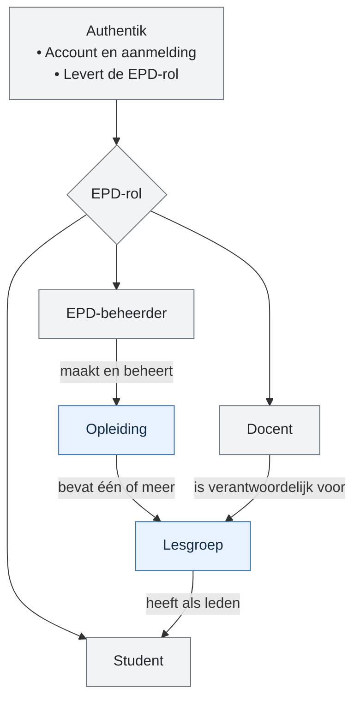

# Werking van opleidingen, lesgroepen en studenten

Dit schema toont hoe een opleiding is ingericht en hoe docenten en studenten bij lesgroepen horen.

## Schema

```mermaid
flowchart TD
    AUTH["Authentik<br/>• Account en aanmelding<br/>• Levert de EPD-rol"] --> ROLE{"EPD-rol"}
    ROLE --> ADMIN["EPD-beheerder"]
    ROLE --> TEACHER["Docent"]
    ROLE --> STUDENT["Student"]

    ADMIN -->|"maakt en beheert"| EDUCATION["Opleiding"]
    EDUCATION -->|"bevat één of meer"| GROUP["Lesgroep"]
    TEACHER -->|"is verantwoordelijk voor"| GROUP
    GROUP -->|"heeft als leden"| STUDENT

    classDef account fill:#f1f3f5,stroke:#6c757d,color:#212529
    classDef organization fill:#e8f1ff,stroke:#3973ac,color:#102a43
    class AUTH,ROLE,ADMIN,TEACHER,STUDENT account
    class EDUCATION,GROUP organization
```
