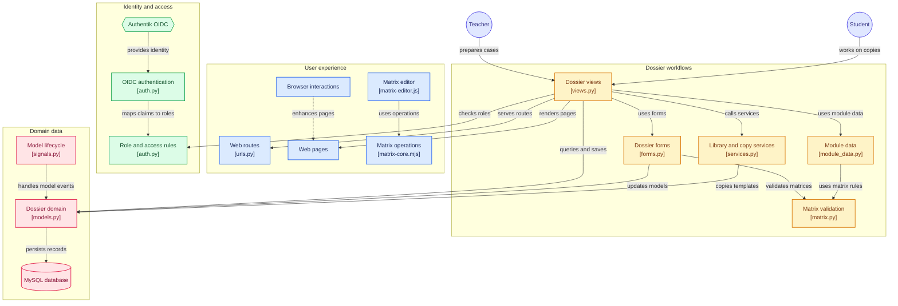

```mermaid
flowchart TD

subgraph group_experience["User experience"]
  node_django_routes["Web routes<br/>[urls.py]"]
  node_web_templates["Web pages"]
  node_browser_assets["Browser interactions"]
  node_matrix_editor["Matrix editor<br/>[matrix-editor.js]"]
  node_matrix_browser_core["Matrix operations<br/>[matrix-core.mjs]"]
end

subgraph group_workflows["Dossier workflows"]
  node_web_views["Dossier views<br/>[views.py]"]
  node_forms["Dossier forms<br/>[forms.py]"]
  node_matrix_validation["Matrix validation<br/>[matrix.py]"]
  node_library_services["Library and copy services<br/>[services.py]"]
  node_module_data["Module data<br/>[module_data.py]"]
end

subgraph group_identity["Identity and access"]
  node_auth_backend["OIDC authentication<br/>[auth.py]"]
  node_identity_provider{{"Authentik OIDC"}}
  node_access_rules["Role and access rules<br/>[auth.py]"]
end

subgraph group_data["Domain data"]
  node_domain_models["Dossier domain<br/>[models.py]"]
  node_lifecycle_signals["Model lifecycle<br/>[signals.py]"]
  node_mysql[("MySQL database")]
end

node_teacher(("Teacher"))
node_student(("Student"))

node_teacher -->|"prepares cases"| node_web_views
node_student -->|"works on copies"| node_web_views
node_web_views -->|"serves routes"| node_django_routes
node_web_views -->|"renders pages"| node_web_templates
node_web_views -->|"uses forms"| node_forms
node_web_views -->|"checks roles"| node_access_rules
node_web_views -->|"calls services"| node_library_services
node_web_views -->|"uses module data"| node_module_data
node_web_views -->|"queries and saves"| node_domain_models
node_forms -->|"validates matrices"| node_matrix_validation
node_forms -->|"updates models"| node_domain_models
node_library_services -->|"copies templates"| node_domain_models
node_module_data -->|"uses matrix rules"| node_matrix_validation
node_lifecycle_signals -->|"handles model events"| node_domain_models
node_domain_models -->|"persists records"| node_mysql
node_identity_provider -->|"provides identity"| node_auth_backend
node_auth_backend -->|"maps claims to roles"| node_access_rules
node_matrix_editor -->|"uses operations"| node_matrix_browser_core
node_browser_assets -.->|"enhances pages"| node_web_templates

click node_django_routes "https://github.com/vives-project-xp/educatiefepd/blob/main/Software/config/urls.py"
click node_web_views "https://github.com/vives-project-xp/educatiefepd/blob/main/Software/dossier/views.py"
click node_web_templates "https://github.com/vives-project-xp/educatiefepd/tree/main/Software/templates"
click node_browser_assets "https://github.com/vives-project-xp/educatiefepd/tree/main/Software/static"
click node_matrix_editor "https://github.com/vives-project-xp/educatiefepd/blob/main/Software/static/matrix-editor.js"
click node_matrix_browser_core "https://github.com/vives-project-xp/educatiefepd/blob/main/Software/static/matrix-core.mjs"
click node_auth_backend "https://github.com/vives-project-xp/educatiefepd/blob/main/Software/dossier/auth.py"
click node_access_rules "https://github.com/vives-project-xp/educatiefepd/blob/main/Software/dossier/auth.py"
click node_forms "https://github.com/vives-project-xp/educatiefepd/blob/main/Software/dossier/forms.py"
click node_matrix_validation "https://github.com/vives-project-xp/educatiefepd/blob/main/Software/dossier/matrix.py"
click node_library_services "https://github.com/vives-project-xp/educatiefepd/blob/main/Software/dossier/services.py"
click node_module_data "https://github.com/vives-project-xp/educatiefepd/blob/main/Software/dossier/module_data.py"
click node_domain_models "https://github.com/vives-project-xp/educatiefepd/blob/main/Software/dossier/models.py"
click node_lifecycle_signals "https://github.com/vives-project-xp/educatiefepd/blob/main/Software/dossier/signals.py"

classDef toneNeutral fill:#f8fafc,stroke:#334155,stroke-width:1.5px,color:#0f172a
classDef toneBlue fill:#dbeafe,stroke:#2563eb,stroke-width:1.5px,color:#172554
classDef toneAmber fill:#fef3c7,stroke:#d97706,stroke-width:1.5px,color:#78350f
classDef toneMint fill:#dcfce7,stroke:#16a34a,stroke-width:1.5px,color:#14532d
classDef toneRose fill:#ffe4e6,stroke:#e11d48,stroke-width:1.5px,color:#881337
classDef toneIndigo fill:#e0e7ff,stroke:#4f46e5,stroke-width:1.5px,color:#312e81
classDef toneTeal fill:#ccfbf1,stroke:#0f766e,stroke-width:1.5px,color:#134e4a
class node_django_routes,node_web_templates,node_browser_assets,node_matrix_editor,node_matrix_browser_core toneBlue
class node_web_views,node_forms,node_matrix_validation,node_library_services,node_module_data toneAmber
class node_auth_backend,node_identity_provider,node_access_rules toneMint
class node_domain_models,node_lifecycle_signals,node_mysql toneRose
class node_teacher,node_student toneIndigo
```