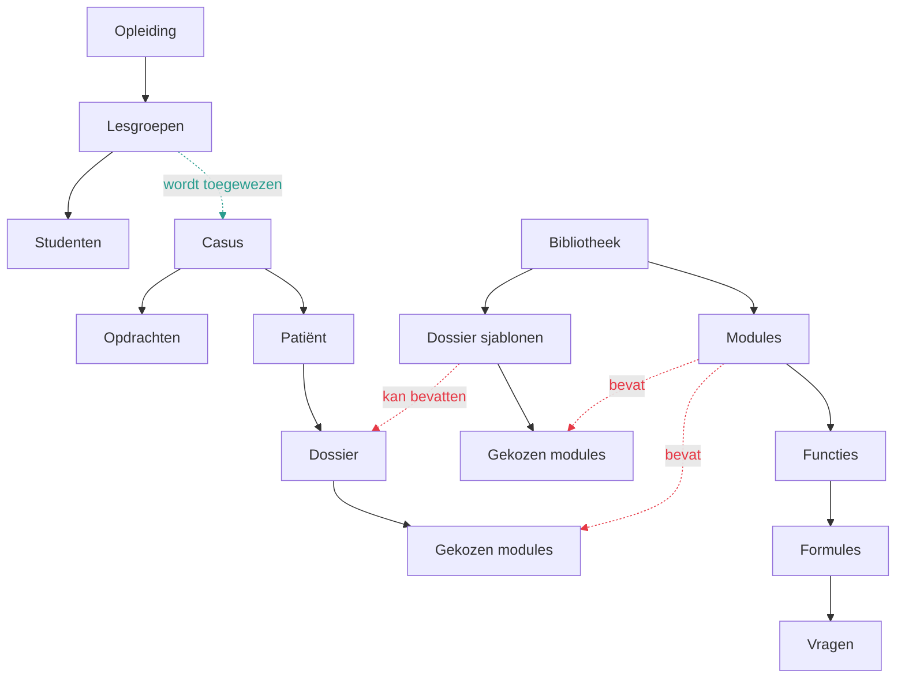

## Structuur van de onderdelen

```mermaid
flowchart TD
    Opl["Opleiding"] --> LG["Lesgroepen"]
    LG --> St["Studenten"]
    LG -. "wordt toegewezen" .-> Casus["Casus"]

    Casus --> Opdr["Opdrachten"]
    Casus --> Pat["Patiënt"]
    Pat --> Dos["Dossier"]
    Dos --> GMc["Gekozen modules"]

    Bib["Bibliotheek"] --> DS["Dossier sjablonen"]
    DS --> GMs["Gekozen modules"]
    Bib --> Mod["Modules"]
    Mod --> Fn["Functies"]
    Fn --> Form["Formules"]
    Form --> Vr["Vragen"]

    Mod -. "bevat" .-> GMs
    DS -. "kan bevatten" .-> Dos
    Mod -. "bevat" .-> GMc

    linkStyle 2 stroke:#2a9d8f,color:#2a9d8f
    linkStyle 13,14,15 stroke:#e63946,color:#e63946
```
